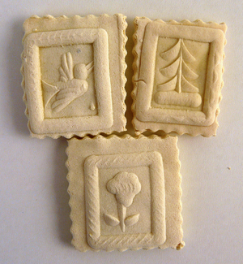

# Springerle [](https://godoc.org/github.com/carlmjohnson/springerle) [](https://goreportcard.com/report/github.com/carlmjohnson/springerle)

Springerle are a kind of German prestamped cookie. Springerle is a command line tool for creating simple prestamped project files with the txtar format and Go templates. Inspired by [Cookiecutter](https://cookiecutter.readthedocs.io/) and [JTree Stamp](https://github.com/publicdomaincompany/jtree/tree/master/langs/stamp).



## Installation

First install [Go](http://golang.org).

If you just want to install the binary to your current directory and don't care about the source code, run

```bash
GOBIN=$(pwd) go install github.com/carlmjohnson/springerle@latest
```

## Screenshots

```
$ springerle -h
springerle - create simple projects with the txtar format and Go templates.

Usage:

    springerle [options] <project file or URL>

Project files are Go templates processed as txtar files. The preamble to the
txtar file is used as prompts for creating the template context. Each line
should be formated as "key: User prompt question? default value" with colon and
question mark used as delimiters. Lines beginning with # or without a colon are
ignored. If the default value is "y" or "n", the prompt will be treated as a
boolean.

In addition to the default Go template functions, templates can use the
following functions.

From package strings:

compare contains containsany containsrune count equalfold fields fieldsfunc
hasprefix hassuffix index indexany indexbyte indexfunc indexrune join lastindex
lastindexany lastindexbyte lastindexfunc map repeat replace replaceall split
splitafter splitaftern splitn title tolower tolowerspecial totitle
totitlespecial toupper toupperspecial tovalidutf8 trim trimfunc trimleft
trimleftfunc trimprefix trimright trimrightfunc trimspace trimsuffix

From package path/filepath:

abs base clean dir ext fromslash isabs join match rel split splitlist toslash
volumename

From package time:

date now parse parseduration

From github.com/huandu/xstrings:

center countpattern delete expandtabs firstrunetolower firstrunetoupper insert
lastpartition leftjustify partition reverse rightjustify runelen runewidth scrub
shuffle shufflesource slice squeeze successor swapcase tocamelcase tokebabcase
tosnakecase translate width wordcount wordsplit

From github.com/mitchellh/go-wordwrap

wrapstring

Options:
  -dest path
        destination path (default ".")
  -dry-run
        dry run output only (output txtar to stdout)
  -verbose
        log debug output (default silent)
```
